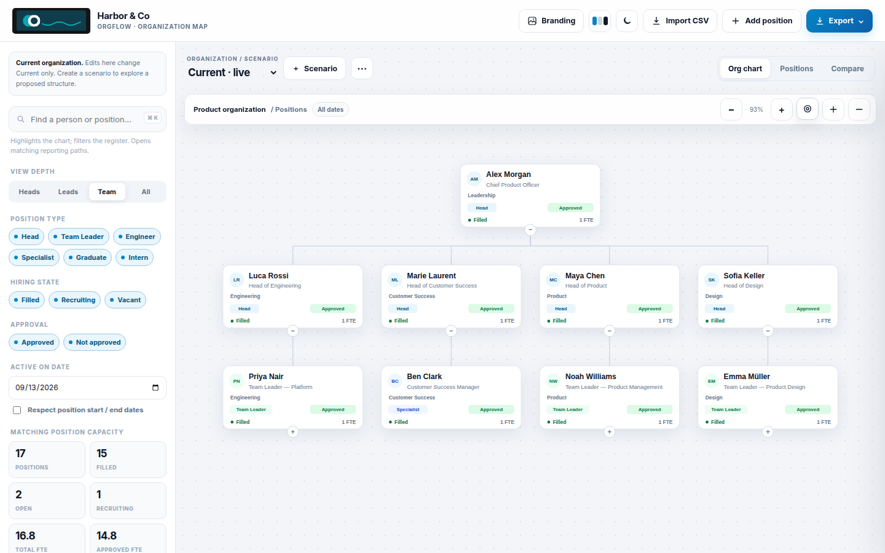
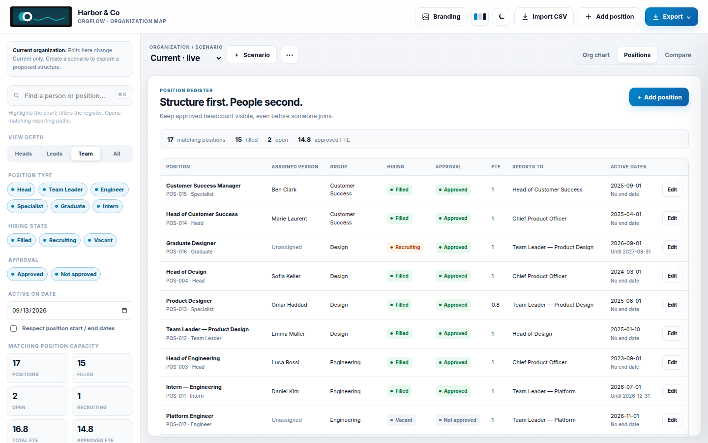
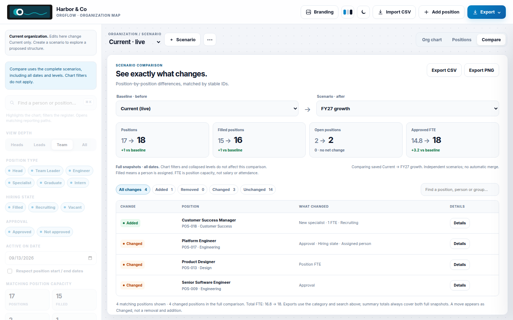
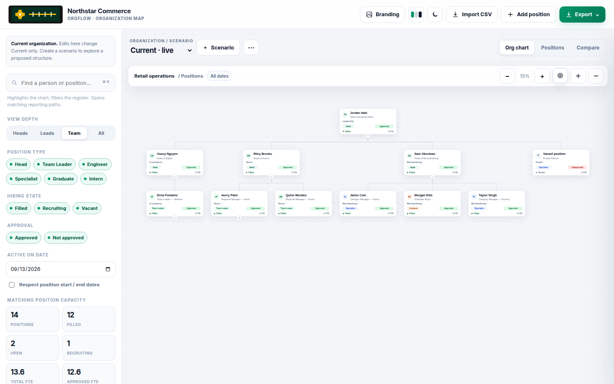
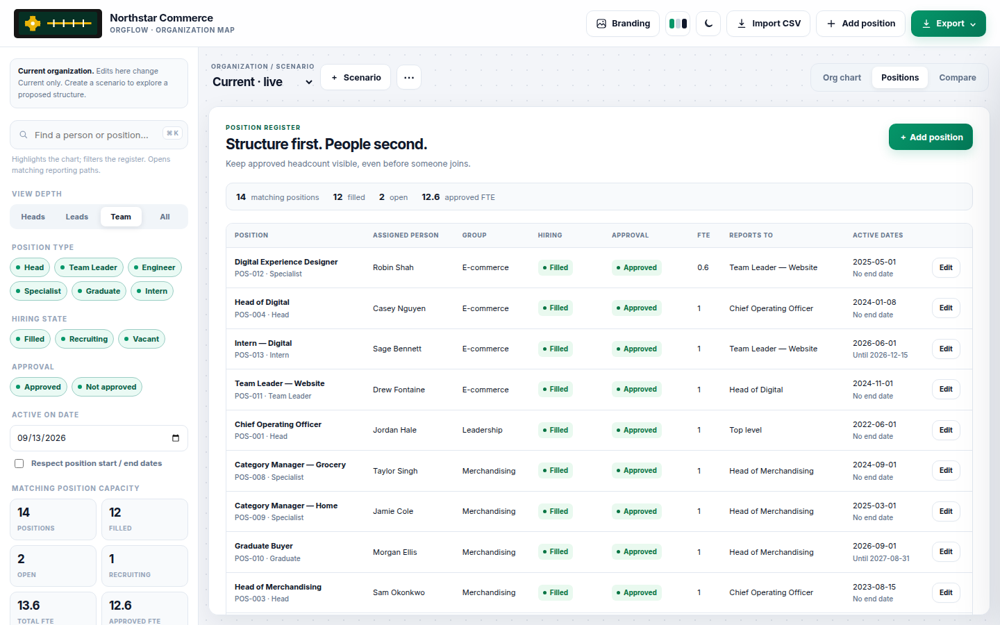
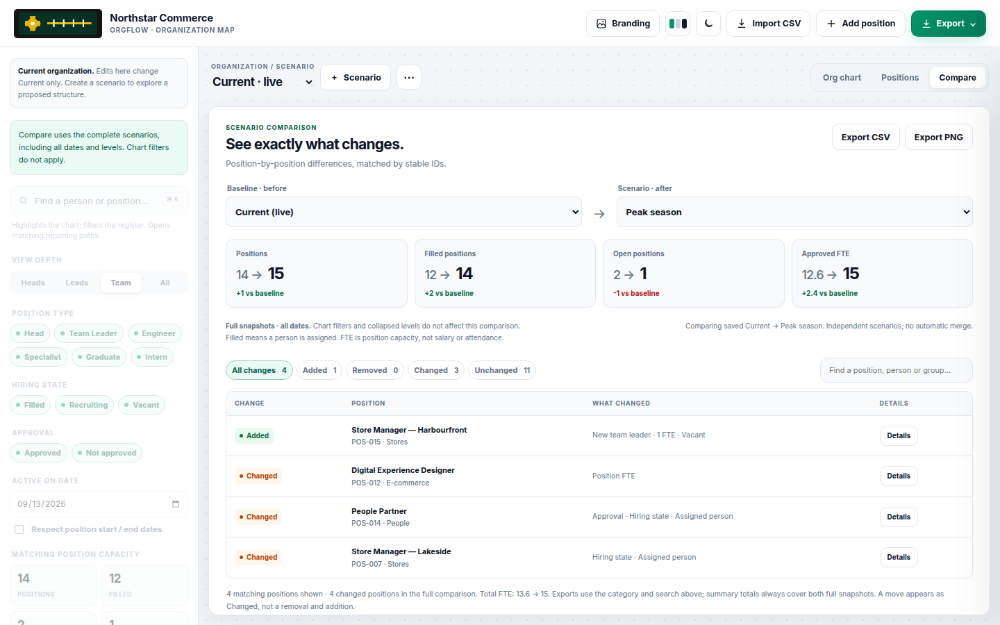

# OrgFlow

Private organization charts and workforce planning in the browser. Positions stay separate from people. Scenarios copy Current instead of overwriting it. Names, photos and logos stay on the device that opened the page until you export a file.

**Live demo:** [deep-quinoa-tbf2.here.now](https://deep-quinoa-tbf2.here.now/) · **Planner:** [app.html](https://deep-quinoa-tbf2.here.now/app.html)

**GitHub Pages:** [ferax564.github.io/OrgFlow](https://ferax564.github.io/OrgFlow/) (after Settings → Pages points at the `gh-pages` branch)



## Open it

The repository root is a static site:

| Path | What it is |
| --- | --- |
| `index.html` | Product landing page (public docs + two ways to run) |
| `app.html` | The planner |
| `login.html` / `admin.html` | Enterprise sign-in and members (not on GitHub Pages) |
| `css/`, `js/`, `assets/`, `examples/` | Styles, logic, icons and samples |

Serve the root over HTTP (GitHub Pages does this in production):

```bash
python3 -m http.server 4173
```

Then open http://localhost:4173/ or http://localhost:4173/app.html. Opening the files as `file://` may block image processing and some exports.

On this public site there is no backend. Clearing site data removes the workspace; export a JSON backup first. An optional Node host can share one org — see [Enterprise host](#enterprise-host-optional).

## Using the planner

Harbor & Co (17 positions) loads on first visit. A tour offers that sample, Northstar Commerce, and smaller templates. Loading a sample overwrites this browser’s scenarios, people and branding.

- **Drag-and-drop** a card onto another card to change reporting. Drops that would create a cycle are ignored. Set a **dotted-line** (matrix) manager in the position drawer; it draws dashed and does not change the tree layout.
- **Undo / redo** with ⌘Z / Ctrl+Z in this session (not while typing in a field). **Earlier versions** in the sidebar keeps the last ten planning snapshots in this browser, without photos or logos.
- **Cards** show the person (or vacant/recruiting), title, group, location, type, approval, hiring state and FTE. Optional photos are resized locally to a small PNG.
- **Custom fields** on a position: location / site, cost center, job family. On a person: employee number and photo.
- **Date filter** is off by default, so future-dated roles stay visible. Turn on **Respect position start / end dates** to hide roles that have not started (or have already ended) relative to the as-of date.
- **Chart filters** (type, hiring, approval, depth, search) apply to the org chart and the Positions register. Compare uses full snapshots and ignores those filters. Loading an example or a blank organization resets filters.
- **Chart display** in the sidebar hides or shows FTE, site, group, position type, approval and hiring on every card. Long names wrap and that card grows. Last-level managers stack their reports in a column under the manager; uncheck **Stack direct reports** in the drawer to spread them. **Move up / Move down** changes sibling order immediately. Add a tag like Engineer, Graduate or Intern under **Position type**. These settings persist and apply to PNG, PDF and HTML exports.
- **Narrow screens** hide the sidebar. Open it with the ☷ **Filters** control in the planning bar. It stays available on Org chart, Positions and Compare.
- **Branding** stores company name, chart title and logos in this browser. Logos are sanitized and rasterized locally.

### Export

| Export | Contents |
| --- | --- |
| Current view as PNG | Visible chart, optionally branded |
| One PNG per group (ZIP) | One chart file per group |
| Board pack (PDF) | Cover sheet, current chart, scenario comparison when a second scenario exists |
| Shareable HTML snapshot | Self-contained page with the chart inline and workspace JSON for restore |
| Positions + assignments (CSV) | Active scenario, including custom fields |
| People directory (CSV) | People in the active scenario |
| Workspace backup (JSON) | Every scenario, unassigned people, branding, palette and the current view |

A workspace JSON that omits `dateFilter` restores with all dates visible.

### Positions CSV columns

`positionId`, `reportsToPositionId`, `secondaryManagerId`, `title`, `type`, `group`, `fte`, `approval`, `hiringState`, `personId`, `name`, `employeeNumber`, `startDate`, `endDate`, `location`, `costCenter`, `jobFamily`

Import can replace, append, or update by position ID. Spreadsheet formulas in cells are prefixed so they stay text.

## Features

- Expandable org chart with level presets and search
- Drag to re-parent; cycle detection
- Last-level managers stack reports by default; optional left-side trunk layout
- Move siblings up or down; reporting order and stacking persist
- Optional wrapping cards with hide/show for FTE, site, group, type, approval and hiring
- Optional cumulative people count on Head and Team Leader cards
- Custom position tags (same kind as Engineer, Graduate, Intern) in addition to the built-in types
- Optional local photos and richer cards (location on the card)
- Dotted-line / matrix managers
- Undo, redo and earlier local versions
- Position types: Head, Team Leader, Engineer, Specialist, Graduate, Intern (plus levels you add)
- Approval and hiring-state filters, including vacant and recruiting seats
- Positions kept separate from people; FTE is position capacity, not salary
- Scenario planning and before/after comparison
- Company branding, light/dark modes, palettes (Indigo, Crimson, Graphite, Ocean, Emerald)
- First-run tour and starter templates (startup, agency, nonprofit)

## Example companies and templates

Fictional product and retail samples — not motorsport teams. Load them from **Example companies** in the sidebar, from the welcome tour, or by restoring JSON from `examples/`.

### Harbor & Co

Product organization across Leadership, Product, Engineering, Design and Customer Success. Includes an **FY27 growth** scenario.

| Org chart | Position register | Scenario compare |
| --- | --- | --- |
|  |  |  |

### Northstar Commerce

Retail operations across Stores, Merchandising, E-commerce and People. Includes a **Peak season** scenario.

| Org chart | Position register | Scenario compare |
| --- | --- | --- |
|  |  |  |

### Starter templates

Smaller orgs shipped in `js/templates.js`, also listed in the sidebar and the first-run tour:

| Template | Shape |
| --- | --- |
| **First Light** | Startup · 8 seats · dotted line from Product Manager to Head of Engineering |
| **Lumen Studio** | Agency · 9 seats · producer dotted to Creative Director |
| **Cedar & Kind** | Nonprofit · 7 seats · partnerships dotted to the Executive Director |

More detail: [`examples/README.md`](examples/README.md).

## GitHub Pages

Pushing to `main` runs `.github/workflows/pages.yml`. That job copies `index.html`, `app.html`, CSS, JS, assets, examples and `.nojekyll` into a `gh-pages` branch. Asset paths are relative so the site works at `https://ferax564.github.io/OrgFlow/` once Pages is serving that branch.

The Actions `GITHUB_TOKEN` cannot turn Pages on (the Pages create API is an admin operation). One-time, in the GitHub UI:

1. **Settings → Pages**
2. **Build and deployment → Source:** Deploy from a branch
3. **Branch:** `gh-pages` / `/ (root)` → Save

Until that is saved, `has_pages` stays false and `ferax564.github.io/OrgFlow` 404s even though the `gh-pages` branch has the site.

The always-on demo is [here.now](https://deep-quinoa-tbf2.here.now/). `login.html` and `admin.html` are not copied onto Pages; they belong to the optional Node host.

## Enterprise host (optional)

The Pages / here.now site stays private and local. For a **shared** organization on your machine or AWS, run the Node host. **Keycloak is not required locally.** The landing page (`index.html`) documents both modes; when that host is running it rewrites Open-app links to `login.html`.

```bash
npm run start:enterprise
```

Open http://127.0.0.1:8787/login.html — any email, first person is admin. The process binds to localhost.

That host also provides:

- Workspace API (save/load the existing `orgflow.workspace` JSON; one org per tenant)
- Optional Keycloak OIDC in production (`AUTH_MODE=oidc`) with an **httpOnly** session cookie
- Members: **admin / editor / viewer**, plus a separate **export** permission
- Optional **subtree scope** (a position id): the API never sends seats outside that branch
- Audit log of load, save and export
- MCP read tools for Cursor / Claude (`npm run mcp` with a member token)

Details, hardening notes, Docker Keycloak, AWS: [`server/README.md`](server/README.md).

## Tests

```bash
npm test
```

The suite covers CSV parsing, spreadsheet-formula escaping, scenario validation, dotted-line rules, custom-field CSV round-trips, starter templates, comparison diffs, example workspaces, filter-set migration, stacked chart layout, sibling reordering, custom position levels, and enterprise ACL/stress cases (forged cookies, path traversal, oversized bodies, last-admin protection, concurrent saves).

With Chrome and `puppeteer-core` installed locally:

```bash
python3 -m http.server 4173   # in one terminal
node scripts/browser-qa.cjs   # full UI pass against that server
node scripts/smoke.cjs        # landing page plus planner; starts its own server on 4174
```

## Privacy

On GitHub Pages and here.now, people names, reporting lines, photos and logos never leave the browser unless you export a file. Logos and photos are processed locally; SVG uploads are sanitized before conversion to PNG. Those hosts serve only the program, not your roster.

The optional enterprise host stores one workspace in SQLite on that machine after sign-in. Roles and subtree scope decide who can load, save or export.

## License

MIT. See [LICENSE](LICENSE).
